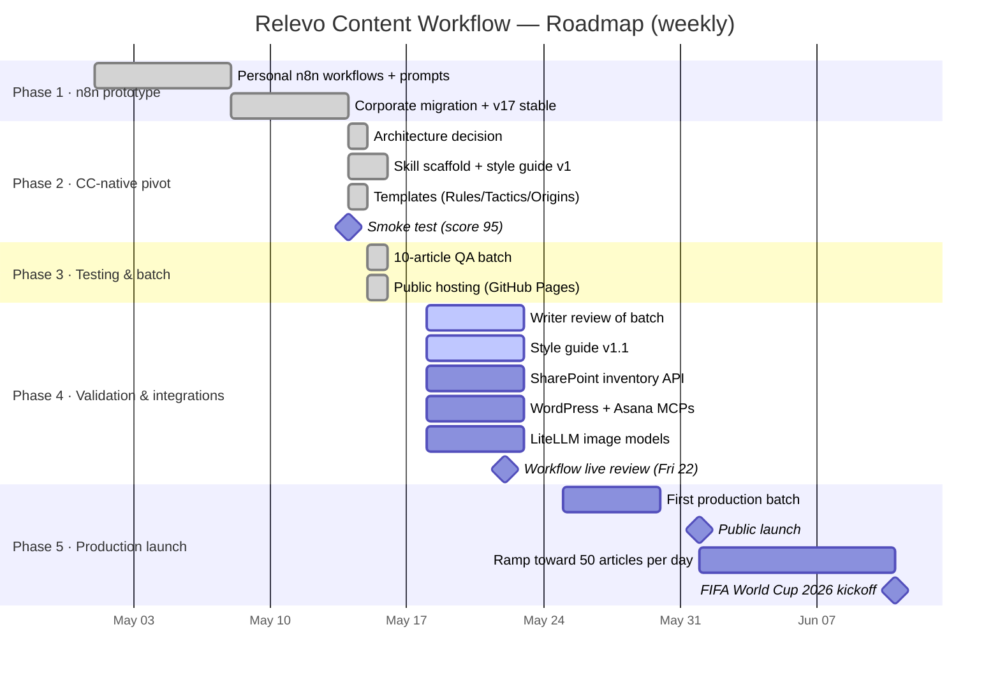

# Relevo Content Workflow

Automated SEO content generation for [relevo.com](https://relevo.com). 24 sports, 3 content categories (Rules & Basics, Tactics Explainers, Origins), multi-pass quality gate. Built as a Claude Code skill replacing the legacy n8n workflow retired on 2026-05-14.

**Current phase:** Phase 4 of 5 — Validation & integrations. Writer review of the May 15 batch is in flight; SharePoint inventory API, WordPress + Asana MCPs, and LiteLLM image models all need to land by **Friday May 22** for the end-to-end workflow review. **Hard launch date: June 1**, ahead of the FIFA World Cup 2026 kickoff on **June 11**.

**Live site:** [jpwaimann.github.io/relevo-content](https://jpwaimann.github.io/relevo-content/) (GitHub Pages from `main`).

**Other documents:** [Project overview](docs/project-overview.html) · [Skill technical reference](docs/README.md) · [Test journal](docs/test-journal.html) · [Backlog](docs/backlog.html)

---

## Roadmap

The project runs from May 1 through the FIFA World Cup 2026 kickoff on June 11. Phases 1–3 are complete; Phase 4 is the current focus and must close on **Friday May 22**; Phase 5 takes the workflow into production with a **hard public launch on June 1**. The Gantt below uses weekly granularity.



### Phase summary

| Phase | Dates | Status | What |
|---|---|---|---|
| 1 — n8n prototype | May 1 – May 13 | ✅ done | Personal n8n workflows; corporate migration to `n8n.bidwhig.com`; v17 stable |
| 2 — CC-native pivot | May 14 | ✅ done | Skill `/relevo` scaffolded; style guide v1; templates for 3 categories; sports 15 → 24; smoke test score 95 |
| 3 — Testing & batch | May 15 | ✅ done | 10-article QA batch (mean 90.3/100); GitHub Pages site |
| 4 — Validation & integrations | May 18 – 22 | 🔴 current | Writer review of the batch; style guide v1.1; SharePoint inventory API (v2 master Excel file created May 15, **148 topics seeded May 18**, all `pending_review`); **WordPress MCP ✓ functional (May 19 — `ig-mcp-proxy` against `relevo-com.sub.plus`, first publish E2E with post 16091 as draft)**; **Asana MCP ✓ functional via `asana_notify.py`**; **LiteLLM image generation ✓ functional (gpt-image-2 via iGaming proxy, integrated into `scripts/imagen/` on May 18)**. End-to-end workflow review on **Friday May 22** |
| 5 — Production launch | May 25 – June 11 | ⏳ next | First production batch the week of May 25; **public launch June 1 (hard deadline)**; ramp toward 50 articles/day; **FIFA World Cup 2026 kickoff June 11** |
| 6 — v2 enhancements | Post-launch (TBD) | 📋 backlog | Search volume integration (Ahrefs / SEMrush); automatic priority logic (P0 / P1 / P2) based on volume, sports calendar, and coverage gaps; sports data API feed for Origins ideation |

---

## v2 enhancements (post-launch backlog)

These items are out of scope for the June 1 MVP launch but are tracked here so the editorial and engineering teams can see where the workflow is heading. None of them have committed dates — they will be scheduled after the FIFA World Cup window has stabilized and we have real production data about what reviewers and the SEO team actually need.

### Search volume integration (Ahrefs / SEMrush)

- **Today:** topics are generated blind from the rulebook plus WebSearch coverage. No keyword volume signal informs topic selection.
- **v2:** pull Ahrefs or SEMrush data per topic candidate so the LLM can rank or filter ideation against real search demand.
- **Blocker for MVP:** no API access is budgeted yet; bringing it in would also slow ideation while we tune the prompt to weigh volume sensibly against editorial judgment.

### Automatic priority logic (P0 / P1 / P2)

- **Today:** every topic written to the inventory is hard-coded to `priority = P1`. No per-topic prioritization decisions are being made.
- **v2:** priority is assigned automatically using a combination of:
  - Search volume (via Ahrefs / SEMrush — depends on the integration above)
  - Sports calendar (football pieces lifted to P0 during May–June 2026 because of the FIFA World Cup; tennis to P0 during Grand Slam weeks; F1 to P0 over race weekends)
  - Coverage gap analysis (sports with fewer existing articles get a P0 lift to balance the catalog)
- **Blocker for MVP:** the human-in-the-loop process for priority review is not designed yet. We are deferring until launch is behind us and we have observed what reviewers actually want to see in the queue.

### Sports data API feed for Origins ideation

- **Today:** Origins topics use WebSearch to surface relevant current players. This carries risk: stale information, missed breakout athletes, inaccurate ages or teams.
- **v2:** integrate a sports data API (e.g. SportRadar, API-Football) so Origins ideation has fresh per-sport context — top scorers, recent transfers, injury comebacks, breakout rookies. Eventually this could auto-suggest player candidates rather than relying on the editor's mental model.
- **Blocker for MVP:** cost and integration time. WebSearch combined with editorial curation is good enough for the first production batches.

---

## Repository structure

```
.
├── index.html                              # landing page (this content rendered)
├── README.md                               # repo README, mirrors the index
├── docs/
│   ├── project-overview.html               # project brief — read first
│   └── README.md                           # technical architecture of the /relevo skill
├── _meta/
│   ├── topics.json                         # topic list for the May 15 batch
│   └── AGENT_CONTRACT.md                   # the contract every generation subagent follows
└── runs/                                   # one directory per generated article
    ├── relevo-rules-smoke-1778792284/      # first smoke test
    └── art-N-1778849077/                   # May 15 batch articles (N = 1..10)
        ├── article.html                    # final version (the publishable output)
        ├── article_draft.html              # pre-revise draft (for traceability)
        ├── article_final.json              # metadata + quality journey
        ├── critique_pass1.json             # first auto-critique pass
        └── critique_pass2.json             # post-revise auto-critique (when applicable)
```

Each generation run produces a self-contained directory. To understand any single article: open `article.html` for the final version, then drill into `critique_pass1.json` to see what the automated critic flagged in the first draft, and into `critique_pass2.json` to confirm the issues were resolved.

---

## Project overview

**Relevo Content** is an automated SEO content generation system for relevo.com. It produces editorial-quality Spanish-language articles across 24 sports and three content categories using a multi-pass pipeline that includes automated critique and fact-checking before any human review.

### Why we rewrote it

The previous n8n implementation worked for a limited topic set but had three structural limitations:

1. **Prompt rigidity.** Editorial voice was encoded inside individual workflow nodes; style changes required a coordinated PR + redeploy across multiple nodes.
2. **No quality gate.** Drafts reached human reviewers without any automated critique stage. Inventions, length misses, and format inconsistencies consumed editorial time.
3. **Limited coverage.** Only 15 sports and 2 categories. Expansion required hand-editing workflow branches.

The Claude Code skill addresses all three. Prompts and templates are versioned markdown that anyone can read and propose changes to. Every draft passes through automated critique against a 15-point editorial checklist before reaching humans. Coverage expands to 24 sports and adds Origins (athlete biographies) as a third category.

### Pipeline

Each article is produced by a deterministic seven-stage pipeline:

1. **Research** — reads the official rulebook PDF (SharePoint) plus authoritative sources.
2. **Draft** — first version against the category template and the Relevo style guide.
3. **Critique pass 1** — internal critic evaluates against the 15-point checklist; returns score 0–100 plus priority fixes.
4. **Revise** — if score < 80 or anti-hallucination check fails, applies fixes. Skipped if the draft passes the gate.
5. **Critique pass 2** — re-scores the revised version. Loop repeats until gate passes or retries exhausted.
6. **Fact-check** — verifies claims; unverifiable specific attributions are softened or removed.
7. **Publish** — uploads to WordPress as `pending_review` and creates an Asana subtask for the reviewer.

The full intermediate state of every article is preserved on disk, giving editors complete traceability into how each piece was produced.

### Cost structure

| Item | Monthly estimate | Notes |
|---|---|---|
| Text generation | $0 marginal | Covered by editor's Claude Code subscription |
| Image generation (gpt-image-2) | $60 – $240 | 50 articles/day × 1–2 images each |
| WordPress / Asana / Graph APIs | $0 | Within standard quotas |
| Infrastructure | $0 | No servers to operate |

For the full project brief — written for someone joining the project — see [`docs/project-overview.html`](docs/project-overview.html).

---

## QA & Testing

Two artifacts demonstrate the pipeline working end-to-end: a single-article smoke test on May 14, and a 10-article quality batch on May 15.

### Smoke test · May 14

The first end-to-end run produced **"Qué es el fuera de juego en fútbol y cómo funciona"**. The pipeline caught and corrected a critical issue automatically.

| Stage | Result |
|---|---|
| Draft | 850 words. Critic returned score 72. |
| Critique pass 1 | Flagged an unverifiable specific attribution and one 78-word paragraph. Length below target. |
| Revise pass 1 | Three priority fixes: removed the attribution, split the long paragraph, extended to 1,592 words with two added H2 sections. |
| Critique pass 2 | **Score 95.** Gate passed. Anti-hallucination resolved. |
| Fact-check | 8 claims verified, 0 corrected. |
| Total elapsed | **132 seconds** |

Artifacts: [final article](runs/relevo-rules-smoke-1778792284/article.html) · [metadata](runs/relevo-rules-smoke-1778792284/article_final.json) · [critique pass 1 (72)](runs/relevo-rules-smoke-1778792284/critique_pass1.json) · [critique pass 2 (95)](runs/relevo-rules-smoke-1778792284/critique_pass2.json)

The automated critic caught a fabricated incident before it reached a human reviewer. This is exactly the failure mode the multi-pass design exists to prevent.

### May 15 batch · 10 articles for editorial review

A balanced sample across the three content categories and five representative sports, generated in approximately 17 minutes of wall clock time.

**Summary:** 10 articles · mean score 90.3 · 19,500 words · 0 gate failures.

| # | Sport | Category | Topic | Score | Words | Final |
|---|---|---|---|---|---|---|
| 1 | Football | tactics | Player positions | 86 | 1,791 | [open](runs/art-1-1778849077/article.html) |
| 2 | Football | tactics | Types of shots | 93 | 1,836 | [open](runs/art-2-1778849077/article.html) |
| 3 | Basketball | rules | FIBA & NBA rules | 92 | 1,995 | [open](runs/art-3-1778849077/article.html) |
| 4 | Basketball | tactics | Types of shots | 91 | 1,683 | [open](runs/art-4-1778849077/article.html) |
| 5 | Tennis | rules | Scoring & tie-break | 88 | 1,998 | [open](runs/art-5-1778849077/article.html) |
| 6 | Tennis | origins | Origins of Carlos Alcaraz | 88 | 2,604 | [open](runs/art-6-1778849077/article.html) |
| 7 | Formula 1 | rules | FIA regulations | 91 | 2,000 | [open](runs/art-7-1778849077/article.html) |
| 8 | Formula 1 | tactics | Pit-stop strategy | 93 | 1,986 | [open](runs/art-8-1778849077/article.html) |
| 9 | MMA | origins | Origins of Ilia Topuria | 89 | 2,567 | [open](runs/art-9-1778849077/article.html) |
| 10 | MMA | rules | UFC rules | 92 | 1,998 | [open](runs/art-10-1778849077/article.html) |

Each entry links to the final published HTML. The full bundle of artifacts is available in each `runs/art-N-1778849077/` directory.

### What reviewers are asked to evaluate

1. **Voice and tone.** Do these read like Relevo articles? Are there expressions or rhythms in the style guide that should change?
2. **Category templates.** Do Rules, Tactics, and Origins each have the structure the team expects?
3. **Anti-hallucination behavior.** Calibrated correctly, or too conservative?
4. **Asana review workflow.** Round-robin assignment, SLA, criteria for return-vs-approve — open for definition by editorial.

### May 19 · First WordPress publish E2E

End-to-end validation of the publication leg of the pipeline. The May 14 smoke article was reused (no new generation) and pushed through the WordPress MCP path to confirm the plumbing works against the real `relevo-com.sub.plus` site.

| Step | Tool | Result |
|---|---|---|
| MCP connection setup | `ig_proxy_set_identity`, `ig_proxy_add_connection` | ✓ identity attached to site, ~200 site tools discovered (posts, media, terms, schema, shortcodes) |
| Featured image upload | `media_upload` | ✓ attachment 16090, 6 thumbnails auto-generated by the Relevo theme (card-feed, card-small, author-avatar, team-logo, player-photo, thumbnail) |
| Post create as draft | `posts_create` | ✓ post 16091, status `draft`, category `futbol`, featured image attached |
| Read-back verification | `posts_get` | ✓ title, slug, excerpt, content (10.5KB HTML), `_thumbnail_id`, taxonomies all persisted |
| Visual review | WP admin editor | ✓ confirmed by the content lead — draft renders correctly with theme |

Open question logged for the next iteration: the `post_author` field was overridden by the WordPress adapter from the value passed (77) to the admin default (1). Either the adapter ignores `post_author` on creation, or a capability check is missing. Not blocking — can be corrected via `posts_update` post-create or set manually from the admin. Will revisit before the first real publish.

A follow-up run on the same day (post 16096) validated the workaround: `posts_update` with `post_author` after creation persists the field correctly. The same run confirmed that the Relevo theme reads the meta description from `post_excerpt` and emits `NewsArticle` + `BreadcrumbList` JSON-LD automatically, closing the SEO follow-ups without pipeline changes.

A third run later the same day stitched every stage of the pipeline together for the first time against a real topic from the live inventory — row 5, "Penalti en fútbol: cuándo se pita y cómo se ejecuta". The skill `/relevo new` is now demonstrably wired end-to-end: inventory pick → research from the IFAB rulebook PDF in SharePoint → multi-pass draft (critique 76 → revise → critique 91, anti-hallucination PASS) → 1536×1024 hero generated by gpt-image-2 with C2PA metadata stripped → media upload to WordPress → post creation as `pending` (post 16100) → authorship fix → inventory advance to `status=review` with quality score. Asana reviewer notification was prepared in dry-run and is deferred until the next session that has an ephemeral PAT.

The full session log is captured in [`docs/test-journal.html`](docs/test-journal.html), with a reusable entry template for future test sessions.

---

## Ownership

- **Pablo Waimann** — technical owner · [pablo.waimann@igaming.com](mailto:pablo.waimann@igaming.com)
- **Main content writer** — owner of the style guide; validates voice and approves structural changes
- **Reviewers** (round-robin) — approve or return articles before publication
- **BI team (Debanjan)** — Azure, SharePoint, and credentials
